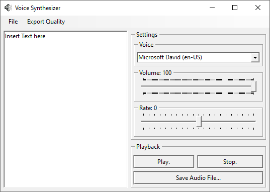

## TTS GENERATOR

This program allows you to access the Microsoft TTS (Text-To-Speech) voices and export any generated audio to a wav file.

# Usage
The program contains the following functionalities:
- File
    - A button to reload the voices, in case not all have been gotten, or new ones have been added afterwards.
    - A button to exit the program.
- Export Quality, changes the samplerate of the exported audio file. All qualities are in 16 bit mono.
    - low: 11025Hz sample rate
    - Medium: 16000Hz sample rate
    - High: 44100Hz sample rate.
- Text field, a large area on the left to enter any plain text for the system to speak.
- Voice Setting, a dropdown showing all loaded voices with their resprective "cultures".
- Volume, a volume slider to change how loud the voice is.
- Rate, a slider that changes how fast the voice speaks. Negative is slower, Positive is faster.
- Play button, starts playback with the given settings.
- Stop button, stops playback and unlocks settings.
- Save Audio File..., Allows for saving the audio file with the given settings and quality to an external file.

